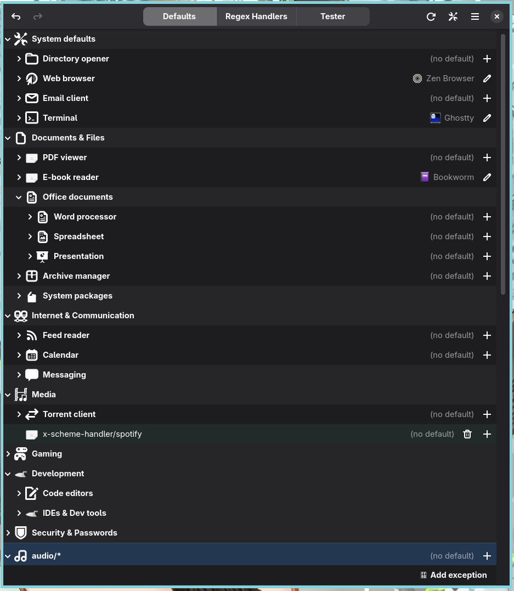
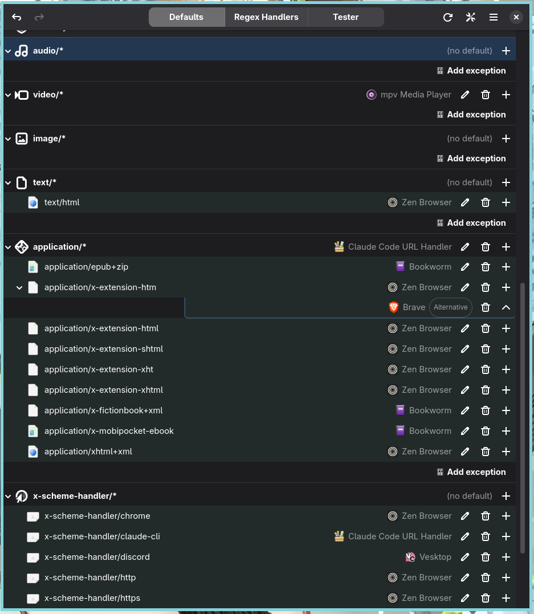
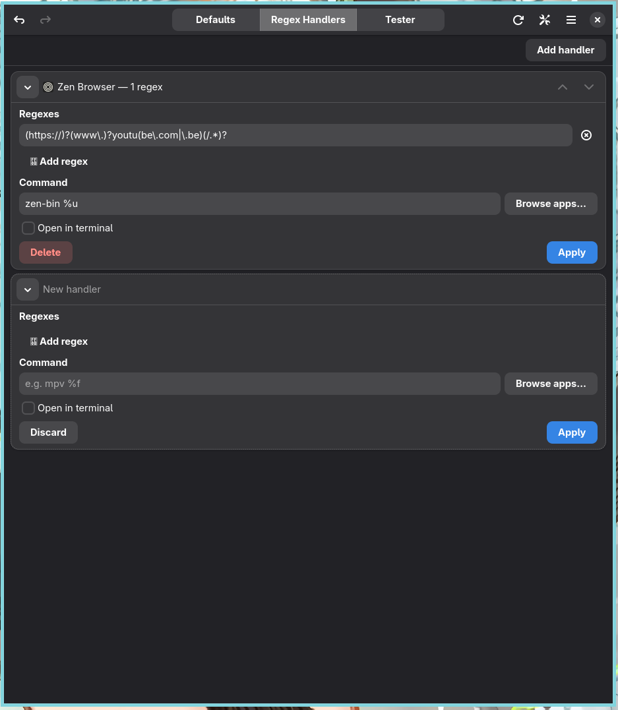
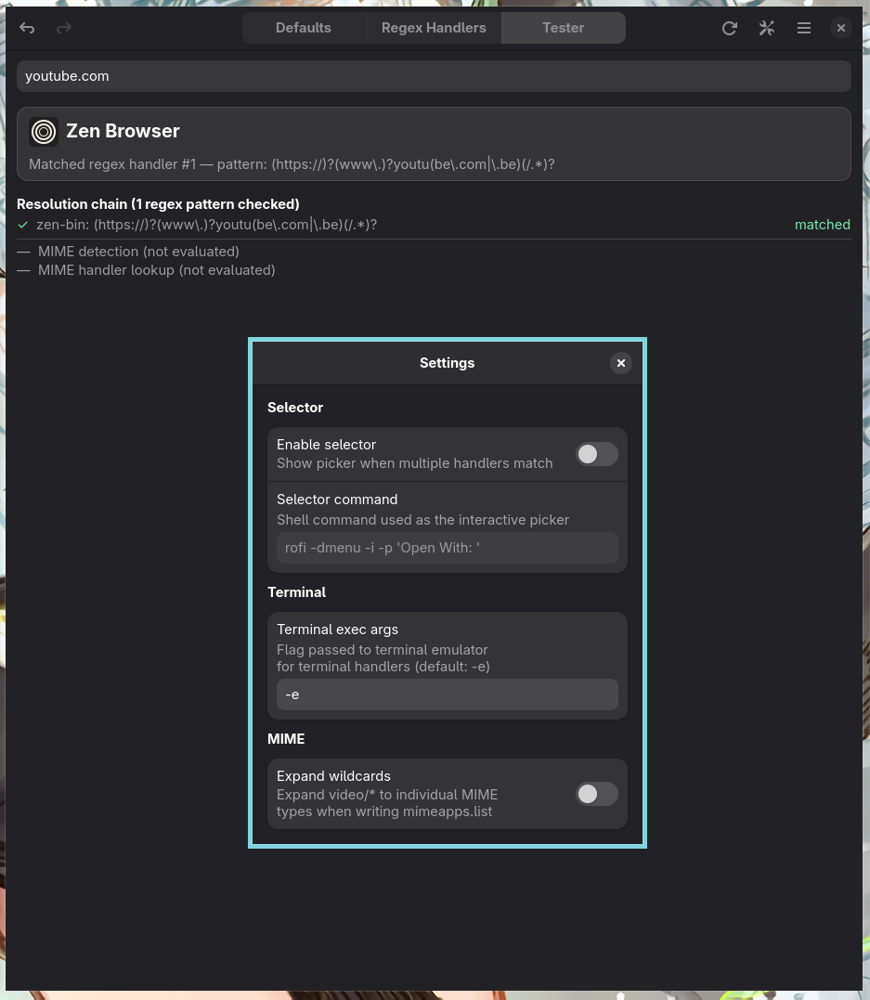

# handlr-gui

GTK4 desktop app for managing default MIME associations via the `handlr` CLI from `handlr-regex`, plus regex URL/path handlers in `handlr.toml`.

## Overview
`handlr-gui` provides a graphical front-end for:
- Editing default application associations per MIME type.
- Managing regex-based handlers in `handlr.toml`.
- Testing which handler wins for a given path/URL/MIME input.

## Features
- **Defaults editor**: Tree view of MIME categories, exceptions, and alternate handlers, with undo/redo for default-association actions.
- **Regex handlers editor**: Card-based UI for `[[handlers]]` entries in `handlr.toml`, with live regex validation and apply/save workflow.
- **Tester**: Paste or type a path/URL/MIME type, or drop a file, to see resolution order and the winning handler.

## Requirements
- `handlr` CLI (`handlr-regex`) installed and available in `PATH`.
- Rust toolchain and GTK4 development libraries for building from source.

## Build and install
- Build: `cargo build --release` (or `make build`).
- Install system-wide: `make install`.
- Install per-user: `make install-user`.
- `PREFIX` defaults to `/usr/local`; `DESTDIR` is supported for packaging.

## Configuration
`handlr-gui` reads and writes the same files as `handlr`:
- `~/.config/mimeapps.list` (default MIME associations)
- `~/.config/handlr/handlr.toml` (regex handlers + settings)

Settings keys in `handlr.toml` managed by the UI:
- `enable_selector`
- `selector`
- `term_exec_args`
- `expand_wildcards`

Regex handlers are defined as `[[handlers]]` with:
- `exec`
- `terminal`
- `regexes`

## Interaction highlights
- Keyboard shortcuts for undo/redo, reload, quit, expand/collapse, and insert/delete actions.
- Drag-and-drop:
  - Drop files onto **Defaults** to jump to the MIME entry.
  - Drop files onto **Tester** to auto-fill and resolve (URLs via typed/pasted input).

## Screenshots

